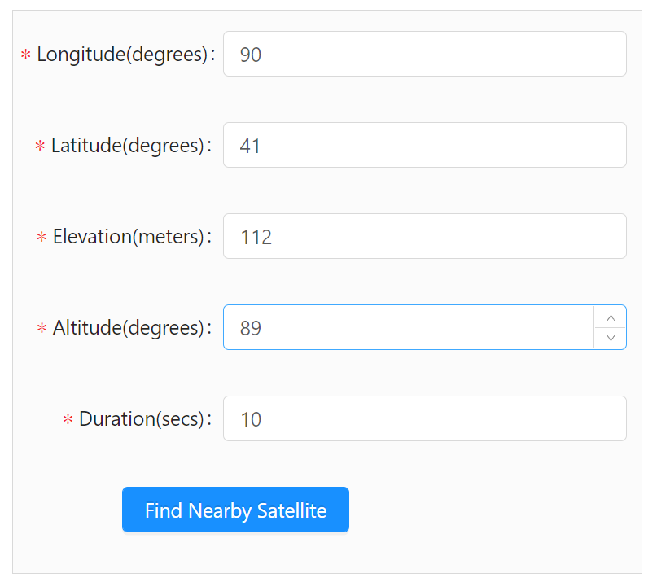
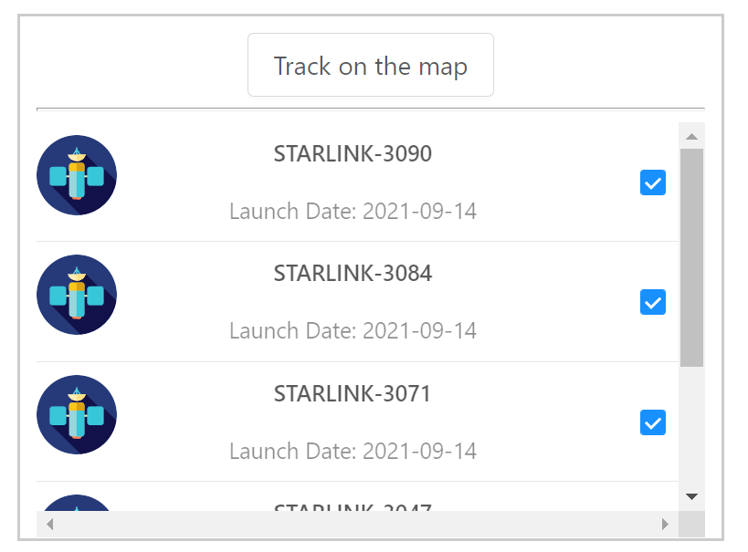
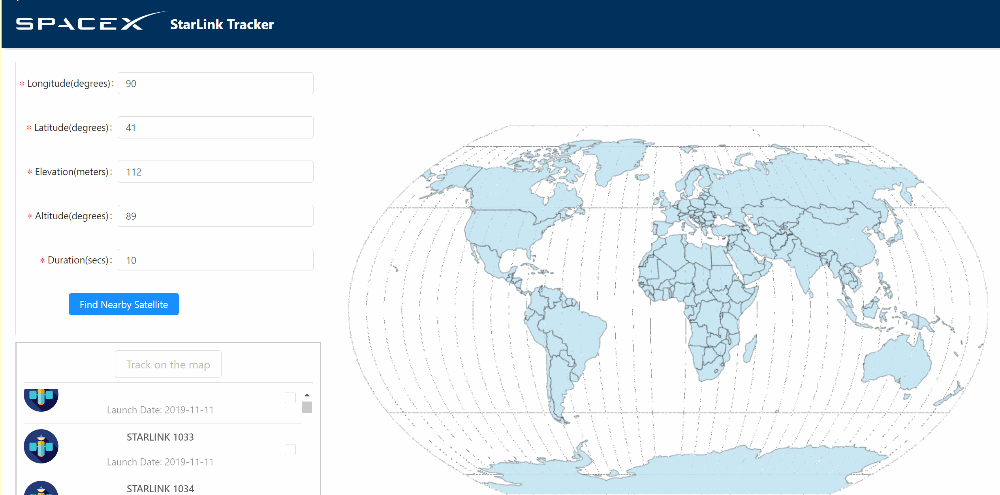

# Starlink Trajectory Visualization

## Introduction

This project is a visualization dashboard using React and D3.JS to track starlink satellites in real-time based on geo-location.

## How to Start

```bash
# Clone this repository
$ git clone https://github.com/peteryoungy/starlink.git

# Go into the repository
$ cd starlink

# Install dependencies
$ npm install

# Run the app
$ npm start
```

## How to track a satellite

**Visit this [website](http://3.133.82.141:3000) for a demo.**

1. Enter Longitude, Latitude, Elevation, Altitude, Duration in the setting form, then click "Find Nearby Satellite" button. (Example parameters: 90, 41, 112, 89, 10)

   <p align='left'>
   	    
   </p>

2. From the satellites showed below, select the ones you are willing to track, then click "Track on the map" button.

   <p align='left'>
   	    
   </p>

3. The trajectory of the selected satellites will be shown in the world map, with a real-time time stamp on top of it.

<p align='left'>
	    
</p>

## API Support

Register on N2YO : [n2yo.com/login/register](https://www.n2yo.com/login/register/)  After login, please visit the profile page [n2yo.com/login/edit](https://www.n2yo.com/login/edit) and scroll down to access the button that generates the API key.

Click here to check the [API document](n2yo.com/api/) the website offers.

### Contact

Yang Yu @[peteryoungy](https://github.com/peteryoungy)
